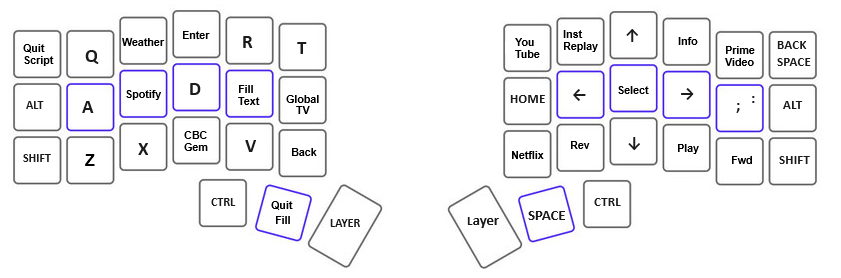

# Roku Remote Python Script

The remote that came with the Roku streaming stick is showing some wear. Replacements are $30 CAD so it seemed like a good 
idea to find an alternative to reduce the rate of wear on the remote. The computer apps I looked at require mouse clicks. One does
not want to be looking at the computer screen when controlling the Roku and TV so I would perfer an app that is controlled by the keyboard and not a mouse.
Some consideration was given to making a DYI remote but in investigating that it became apparent it would be possible to make a simple Python script that 
can control the Roku. Since I use a split keyboard, with a only 21 keys per side, it is easy to use the keyboard without looking at it.



This is essentially the first layer of this keyboard. The alternate functions of the keys in this case only are in effect when the python script has focus.

Below is a screenshot of the Anaconda window. The app was written for use in windows and would need adjustment for other operating systems.


## Exploring Using Curl on the Command Line

Roku has published information on controlling Roku devices via WiFi at:

[external-control-api.md](https://developer.roku.com/en-ca/docs/developer-program/dev-tools/external-control-api.md)

On a computer one can send commands to a Roku using curl. For example:

````
C:\Users\xxx>curl http://192.168.0.25:8060/query/apps
````

* Note that one needs to replace the IP address with the IP address for their own Roku.
* The port 8060 should be correct for all Roku devices that permit use of WiFi for control as far as I am aware

The Roku will respond with a list of apps. The list includes the app-id for each app. This id can be used to 
launch the individual apps with another command:

````
C:\Users\xxx>curl -d '' http://192.168.0.25:8060/launch/837
````

That will launch the YouTube app.

### Examples of remote keypress emulation

~~~~
C:\Users\xxx>curl -d '' http://192.168.0.25:8060/keypress/Setect

C:\Users\xxx>curl -d '' http://192.168.0.25:8060/keypress/Home

C:\Users\xxx>curl -d '' http://192.168.0.25:8060/keypress/Left

C:\Users\xxx>curl -d '' http://192.168.0.25:8060/keypress/Right
~~~~

## Using a Simple Python Script

Looking for a simple Python script for controlling a Roku I came across:

[Roku-control-client-for-Python/td-p/395718](https://community.roku.com/t5/Roku-Developer-Program/Roku-control-client-for-Python/td-p/395718)

The code was old and written for python 2. A utility was used to convert the code to work in python 3.
The code obtain provided functions that could be used to interact with a Roku. A control loop was added that would
respond to single character keypresses on a computer keyboard and send commands to the Roku. Note that the script 
is active when the command window has focus.

The script can be launched with a batch file. I use an Anaconda terminal as shown in the screen shot:


